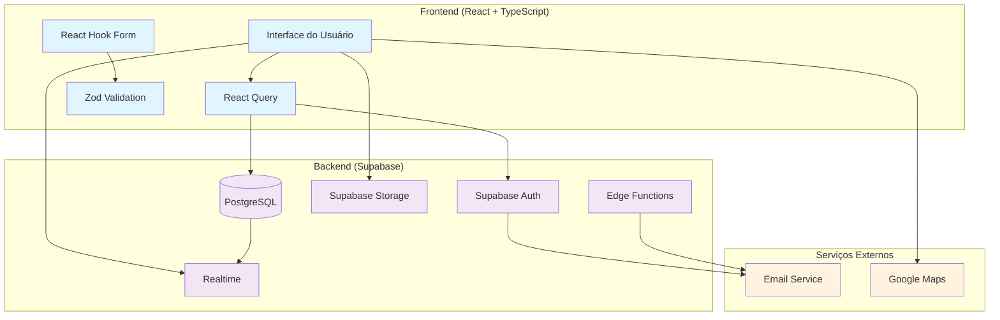
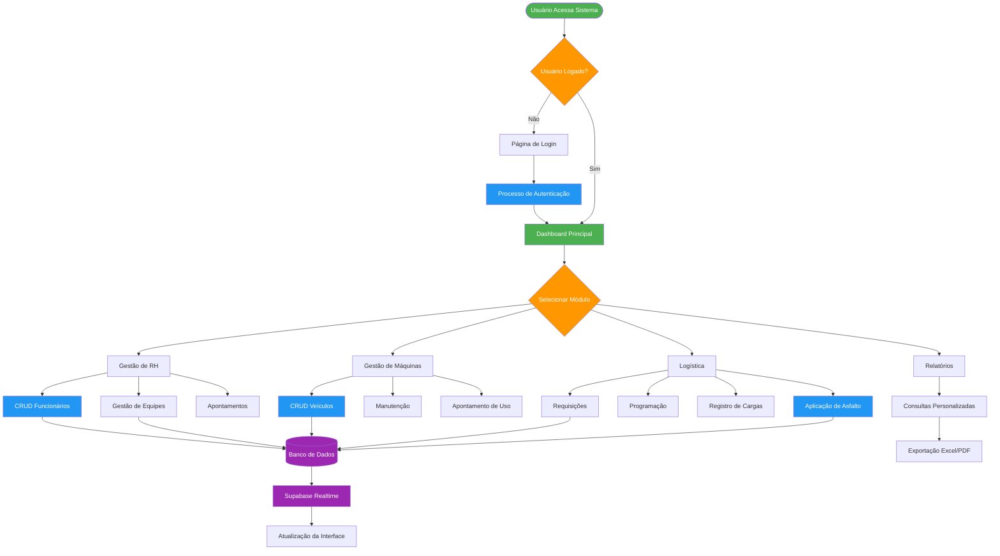
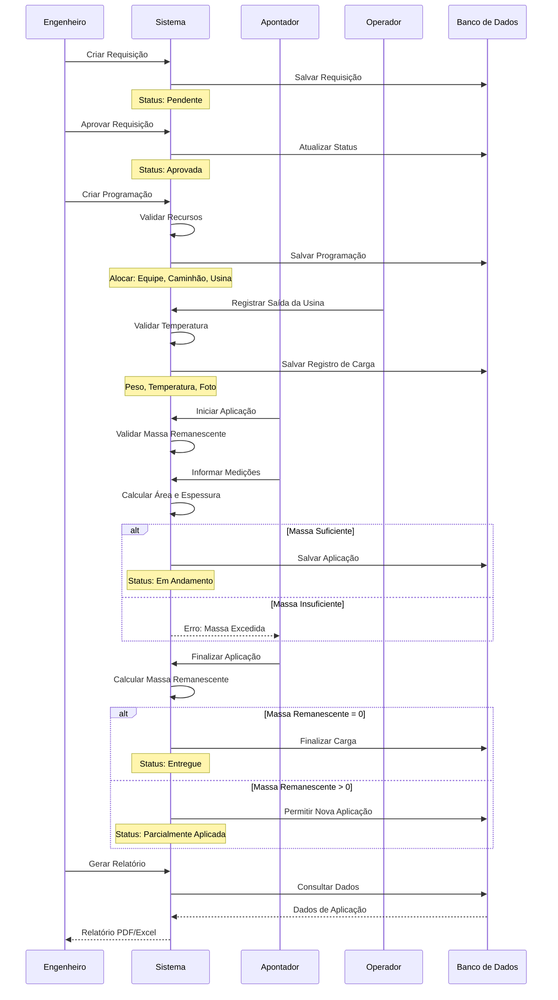
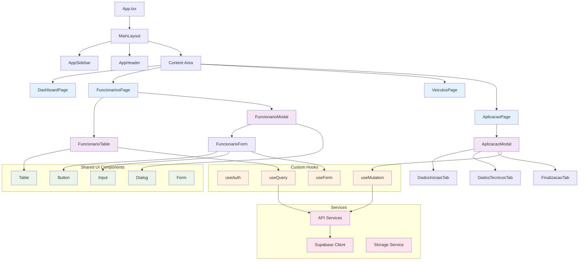
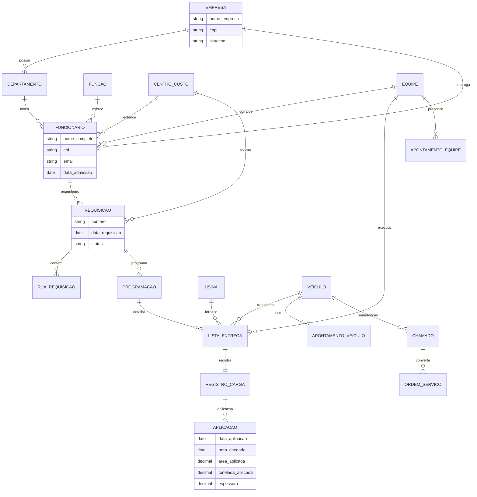
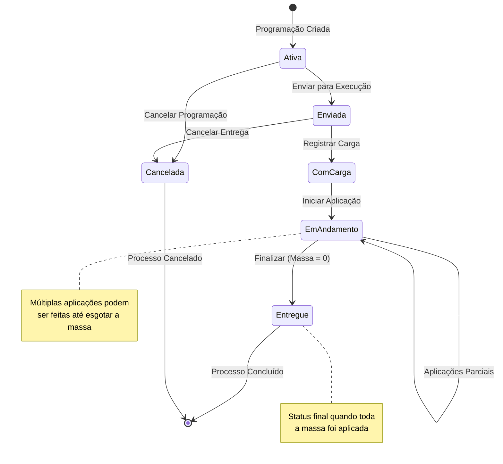
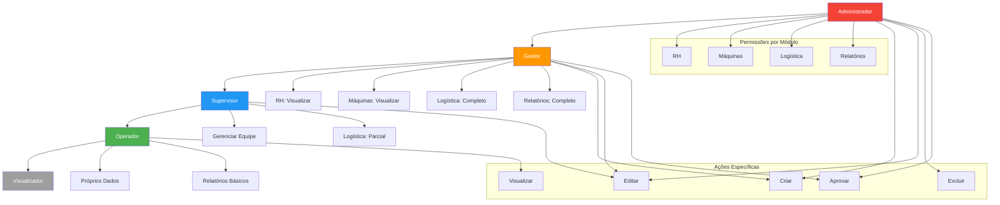
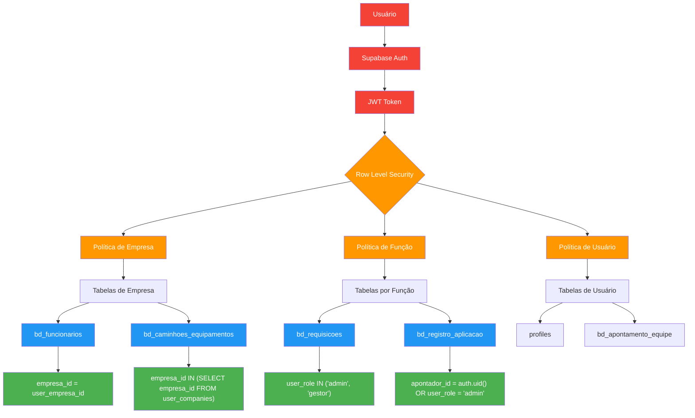
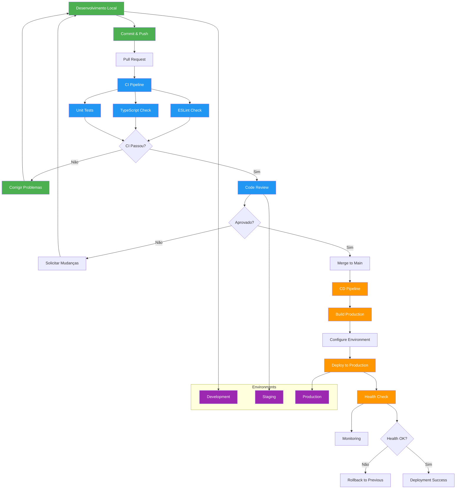

# Diagramas e Fluxogramas 📊

## Visão Geral da Arquitetura



## Fluxo de Dados Principal



## Fluxo de Aplicação de Asfalto



## Arquitetura de Componentes React



## Modelo de Dados Simplificado



## Fluxo de Estados de Entrega



## Hierarquia de Permissões



## Fluxo de Cálculos de Aplicação

```mermaid
flowchart TD
    START([Início da Aplicação]) --> INPUT_MEDIDAS[Inserir Medidas]
    
    INPUT_MEDIDAS --> COMPRIMENTO{Comprimento > 0?}
    COMPRIMENTO -->|Não| ERROR_COMP[Erro: Comprimento Inválido]
    COMPRIMENTO -->|Sim| LARGURA{Largura > 0?}
    
    LARGURA -->|Não| ERROR_LARG[Erro: Largura Inválida]
    LARGURA -->|Sim| CALC_AREA[Calcular Área]
    
    CALC_AREA --> AREA_CALC[Área = Comprimento × Largura]
    AREA_CALC --> INPUT_MASSA[Inserir Massa Aplicada]
    
    INPUT_MASSA --> VALIDATE_MASSA{Massa ≤ Massa Remanescente?}
    VALIDATE_MASSA -->|Não| ERROR_MASSA[Erro: Massa Excede Disponível]
    VALIDATE_MASSA -->|Sim| CALC_ESPESSURA[Calcular Espessura]
    
    CALC_ESPESSURA --> ESPESSURA_CALC[Espessura = (Massa ÷ Área) ÷ 2.4 × 100]
    ESPESSURA_CALC --> VALIDATE_ESPESSURA{3cm ≤ Espessura ≤ 15cm?}
    
    VALIDATE_ESPESSURA -->|Não| WARNING_ESP[Aviso: Espessura Fora do Padrão]
    VALIDATE_ESPESSURA -->|Sim| CALC_REMANESCENTE[Calcular Massa Remanescente]
    WARNING_ESP --> CONFIRM{Confirmar Mesmo Assim?}
    CONFIRM -->|Não| INPUT_MEDIDAS
    CONFIRM -->|Sim| CALC_REMANESCENTE
    
    CALC_REMANESCENTE --> REMANESCENTE_CALC[Remanescente = Massa Total - Σ Aplicações]
    REMANESCENTE_CALC --> CHECK_FINAL{Remanescente ≤ 0.001t?}
    
    CHECK_FINAL -->|Sim| FINALIZAR_CARGA[Finalizar Carga]
    CHECK_FINAL -->|Não| PERMITIR_NOVA[Permitir Nova Aplicação]
    
    FINALIZAR_CARGA --> CALC_MEDIA[Calcular Espessura Média]
    CALC_MEDIA --> UPDATE_STATUS[Status = Entregue]
    UPDATE_STATUS --> END([Fim])
    
    PERMITIR_NOVA --> SAVE_PARTIAL[Salvar Aplicação Parcial]
    SAVE_PARTIAL --> END
    
    %% Error flows
    ERROR_COMP --> INPUT_MEDIDAS
    ERROR_LARG --> INPUT_MEDIDAS
    ERROR_MASSA --> INPUT_MEDIDAS
    
    %% Styling
    classDef input fill:#e3f2fd
    classDef calc fill:#e8f5e8
    classDef decision fill:#fff3e0
    classDef error fill:#ffebee
    classDef success fill:#e8f5e8
    
    class INPUT_MEDIDAS,INPUT_MASSA input
    class AREA_CALC,ESPESSURA_CALC,REMANESCENTE_CALC,CALC_MEDIA calc
    class COMPRIMENTO,LARGURA,VALIDATE_MASSA,VALIDATE_ESPESSURA,CHECK_FINAL,CONFIRM decision
    class ERROR_COMP,ERROR_LARG,ERROR_MASSA,WARNING_ESP error
    class FINALIZAR_CARGA,UPDATE_STATUS,SAVE_PARTIAL success
```

## Arquitetura de Segurança (RLS)



## Performance e Otimização

```mermaid
graph TD
    %% Performance Challenges
    PERF_ISSUES[Problemas de Performance] --> LARGE_TABLES[Tabelas Grandes]
    PERF_ISSUES --> COMPLEX_QUERIES[Consultas Complexas]
    PERF_ISSUES --> HEAVY_UI[Interface Pesada]
    
    %% Database Optimizations
    LARGE_TABLES --> INDEXES[Índices Estratégicos]
    LARGE_TABLES --> PAGINATION[Paginação]
    LARGE_TABLES --> ARCHIVING[Arquivamento de Dados]
    
    COMPLEX_QUERIES --> VIEWS[Views Materializadas]
    COMPLEX_QUERIES --> FUNCTIONS[Funções do Banco]
    COMPLEX_QUERIES --> QUERY_OPT[Otimização de Queries]
    
    %% Frontend Optimizations
    HEAVY_UI --> LAZY_LOADING[Lazy Loading]
    HEAVY_UI --> MEMOIZATION[Memoização]
    HEAVY_UI --> VIRTUALIZATION[Virtualização]
    HEAVY_UI --> CODE_SPLITTING[Code Splitting]
    
    %% Specific Solutions
    INDEXES --> COMP_INDEXES[Índices Compostos]
    INDEXES --> PARTIAL_INDEXES[Índices Parciais]
    
    PAGINATION --> CURSOR_PAGING[Cursor Pagination]
    PAGINATION --> OFFSET_PAGING[Offset Pagination]
    
    LAZY_LOADING --> ROUTE_LAZY[Route-based Lazy]
    LAZY_LOADING --> COMPONENT_LAZY[Component Lazy]
    
    MEMOIZATION --> REACT_MEMO[React.memo]
    MEMOIZATION --> USE_MEMO[useMemo]
    MEMOIZATION --> USE_CALLBACK[useCallback]
    
    %% Monitoring
    subgraph "Monitoramento"
        METRICS[Métricas de Performance]
        ALERTS[Alertas Automáticos]
        PROFILING[Profiling Contínuo]
    end
    
    INDEXES --> METRICS
    LAZY_LOADING --> METRICS
    METRICS --> ALERTS
    ALERTS --> PROFILING
    
    %% Styling
    classDef problem fill:#f44336,color:#fff
    classDef solution fill:#4caf50,color:#fff
    classDef optimization fill:#2196f3,color:#fff
    classDef monitoring fill:#ff9800,color:#fff
    
    class PERF_ISSUES,LARGE_TABLES,COMPLEX_QUERIES,HEAVY_UI problem
    class INDEXES,PAGINATION,VIEWS,LAZY_LOADING solution
    class COMP_INDEXES,CURSOR_PAGING,REACT_MEMO optimization
    class METRICS,ALERTS,PROFILING monitoring
```



## Deployment e CI/CD



---

**Estes diagramas fornecem uma visão visual completa da arquitetura, fluxos de dados e processos do sistema. São úteis para entender rapidamente como os componentes interagem e como os dados fluem pela aplicação.**
